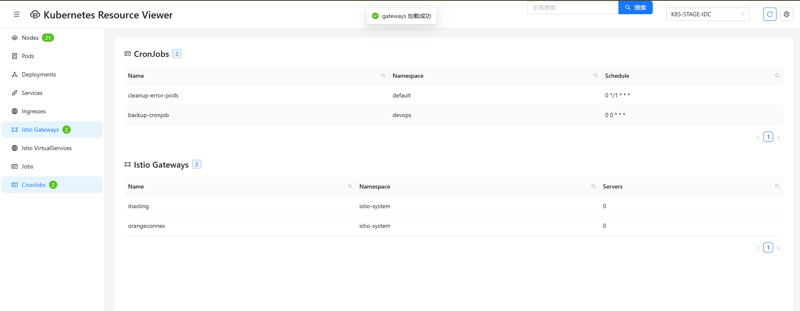

# Kubernetes Resource Viewer

这是一个用于查看多个Kubernetes集群资源的Web应用。它支持查看节点、Pod、Deployment、Service、Ingress、Istio Gateway、VirtualService、Job和CronJob等资源。

## 功能特点

- 支持多集群切换
- 分类展示各种Kubernetes资源
- 资源按需加载，提高性能
- 支持Istio资源的查看
- 现代化的用户界面
- 实时数据刷新

## 项目结构

```
.
├── backend/
│   ├── app/
│   │   └── main.py
│   ├── Dockerfile
│   └── requirements.txt
├── frontend/
│   ├── public/
│   │   └── index.html
│   ├── src/
│   │   ├── App.js
│   │   └── index.js
│   ├── Dockerfile
│   ├── nginx.conf
│   └── package.json
├── kubeconfig/
│   └── (存放k8s或K8S开头的kubeconfig文件)
└── docker-compose.yml
```

## 部署方式

### 使用Docker Compose（推荐）

1. 确保安装了Docker和Docker Compose

2. 将kubeconfig文件放在`kubeconfig`目录下，文件名需以`k8s`或`K8S`开头

3. 构建和启动服务：
   ```bash
   docker-compose up -d
   ```

4. 访问应用：
   - 打开浏览器访问 http://localhost
   - API服务地址：http://localhost:8000

### 手动部署

#### 后端

1. 进入后端目录：
   ```bash
   cd backend
   ```

2. 创建虚拟环境（可选）：
   ```bash
   python -m venv venv
   source venv/bin/activate  # Linux/Mac
   # 或
   .\venv\Scripts\activate  # Windows
   ```

3. 安装依赖：
   ```bash
   pip install -r requirements.txt
   ```

4. 运行后端服务：
   ```bash
   cd app
   uvicorn main:app --host 0.0.0.0 --port 8000
   ```

#### 前端

1. 进入前端目录：
   ```bash
   cd frontend
   ```

2. 安装依赖：
   ```bash
   npm install
   ```

3. 运行开发服务器：
   ```bash
   npm start
   ```

4. 构建生产版本：
   ```bash
   npm run build
   ```

## 使用说明

1. 将您的kubeconfig文件放在`kubeconfig`目录下，文件名需以`k8s`或`K8S`开头
2. 启动服务（使用docker-compose或手动启动）
3. 在浏览器中访问应用
4. 使用顶部的下拉菜单切换不同的集群
5. 点击要查看的资源类型面板，资源信息会动态加载

## 支持的资源类型

- Nodes（节点）
- Pods（容器组）
- Deployments（部署）
- Services（服务）
- Ingresses（入口）
- Istio Gateways（网关）
- Istio VirtualServices（虚拟服务）
- Jobs（任务）
- CronJobs（定时任务）

## 注意事项

- 确保kubeconfig文件中包含正确的集群访问凭证
- 后端服务需要能够访问Kubernetes API服务器
- 如果使用手动部署，前端默认连接到`localhost:8000`的后端服务，如需修改请更新`frontend/src/App.js`中的`API_BASE_URL`
- 使用Docker部署时，确保Docker有足够的资源（CPU/内存）
- 建议在生产环境中启用HTTPS并配置适当的安全措施

## 开发说明

- 后端使用FastAPI框架，提供RESTful API
- 前端使用React和Ant Design构建
- 资源按需加载，提高性能和用户体验
- 支持实时刷新和错误处理
- 使用Docker多阶段构建优化镜像大小 